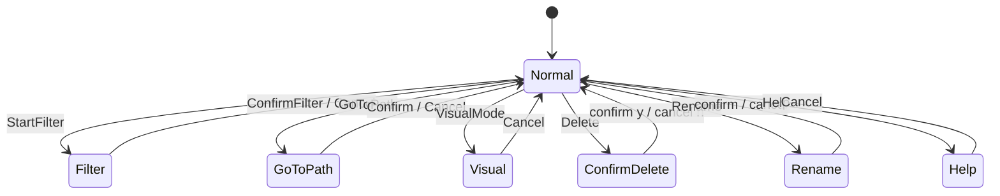

# R-TVUI — Full implementation specification

**Version:** 1.0  
**Status:** Codegen-ready blueprint  
**Related:** [DESIGN_SPEC.md](./DESIGN_SPEC.md), [IMPLEMENTATION_PLAN.md](./IMPLEMENTATION_PLAN.md)

This document is the **complete build specification** for R-TVUI: every crate, file, type, message, and wiring needed to produce a **working terminal file explorer** through milestone **M3**. It is written for humans and codegen agents—**do not treat this as a plan**; treat it as the contract to implement.

**Out of scope for this document:** actual Rust source bodies, CI secrets, release signing, website.

---

## Table of contents

1. [Definition of “working app”](#1-definition-of-working-app)
2. [Repository tree (every file)](#2-repository-tree-every-file)
3. [Workspace & dependencies](#3-workspace--dependencies)
4. [Runtime architecture](#4-runtime-architecture)
5. [Global types & IDs](#5-global-types--ids)
6. [Crate: `r-tvui_core`](#6-crate-r-tvui_core)
7. [Crate: `r-tvui_fs`](#7-crate-r-tvui_fs)
8. [Crate: `r-tvui_config`](#8-crate-r-tvui_config)
9. [Crate: `r-tvui_terminal`](#9-crate-r-tvui_terminal)
10. [Crate: `r-tvui_preview`](#10-crate-r-tvui_preview)
11. [Crate: `r-tvui_tasks`](#11-crate-r-tvui_tasks)
12. [Crate: `r-tvui_plugin_api`](#12-crate-r-tvui_plugin_api)
13. [Crate: `r-tvui_ui`](#13-crate-r-tvui_ui)
14. [Crate: `r-tvui_app`](#14-crate-r-tvui_app)
15. [Crate: `r-tvui_cli`](#15-crate-r-tvui_cli)
16. [Event loop & state machine](#16-event-loop--state-machine)
17. [Keymap & action dispatch](#17-keymap--action-dispatch)
18. [Configuration schema (TOML)](#18-configuration-schema-toml)
19. [Built-in themes](#19-built-in-themes)
20. [Default keybindings data](#20-default-keybindings-data)
21. [UI layout & widget contracts](#21-ui-layout--widget-contracts)
22. [Preview pipeline (sequence)](#22-preview-pipeline-sequence)
23. [File operations & task queue](#23-file-operations--task-queue)
24. [Error handling conventions](#24-error-handling-conventions)
25. [Tests to implement](#25-tests-to-implement)
26. [Examples & assets](#26-examples--assets)
27. [CI & tooling files](#27-ci--tooling-files)
28. [Codegen build order](#28-codegen-build-order)
29. [Milestone acceptance matrix](#29-milestone-acceptance-matrix)

---

## 1. Definition of “working app”

A **working app** means: running `r-tvui` from a release or `cargo run -p r-tvui_cli` opens a fullscreen TUI, lists the current directory, accepts keyboard input, updates the screen at ~60 Hz (or on event), and exits cleanly restoring the terminal.

| Milestone | User-visible capability | Internal requirement |
|-----------|-------------------------|----------------------|
| **M0** | List cwd, j/k/h/l/q | Sync listing acceptable; no tabs/preview |
| **M1** | Tabs, filter, async list, text preview, config | Tokio + channels; cancellable preview |
| **M2** | Visual selection, copy/move/delete/rename, progress, trash | Task queue + confirm overlays |
| **M3** | Split pane, image preview (gated), external tools, git hint | Terminal caps + optional features |
| **M4** | Load example plugin | `r-tvui_plugin_api` + static registry |

**Minimum shippable product (M1)** is the first “daily driver.” **Full spec in this doc targets M3**; M4 is an appendix section.

---

## 2. Repository tree (every file)

Create this tree exactly. Files marked `(M0)` … `(M4)` indicate first milestone that needs the file; unmarked files are required for M1+.

```text
R-TVUI/
├── Cargo.toml                          # workspace root
├── rust-toolchain.toml                 # pin 1.75+ (or project MSRV)
├── CHANGELOG.md
├── README.md                           # quick start (update from docs/README.md)
├── LICENSE                             # TBD
├── .gitignore
├── .github/
│   └── workflows/
│       └── ci.yml
├── assets/
│   └── default_config.toml             # shipped default; copied on first run
├── docs/
│   ├── README.md
│   ├── DESIGN_SPEC.md
│   ├── IMPLEMENTATION_PLAN.md
│   └── IMPLEMENTATION.md               # this file
├── crates/
│   ├── r-tvui_core/
│   │   ├── Cargo.toml
│   │   └── src/
│   │       ├── lib.rs
│   │       ├── ids.rs
│   │       ├── path_types.rs
│   │       └── time.rs
│   ├── r-tvui_fs/
│   │   ├── Cargo.toml
│   │   └── src/
│   │       ├── lib.rs
│   │       ├── entry.rs
│   │       ├── list_dir.rs
│   │       ├── cache.rs
│   │       ├── canonical.rs
│   │       ├── metadata.rs
│   │       └── errors.rs
│   ├── r-tvui_config/
│   │   ├── Cargo.toml
│   │   └── src/
│   │       ├── lib.rs
│   │       ├── schema.rs
│   │       ├── load.rs
│   │       ├── paths.rs
│   │       ├── keymap.rs
│   │       └── theme.rs
│   ├── r-tvui_terminal/
│   │   ├── Cargo.toml
│   │   └── src/
│   │       ├── lib.rs
│   │       ├── capabilities.rs
│   │       ├── backend.rs          # (M0) init/restore terminal
│   │       └── doctor.rs           # (M2) r-tvui doctor output
│   ├── r-tvui_preview/
│   │   ├── Cargo.toml
│   │   └── src/
│   │       ├── lib.rs
│   │       ├── pipeline.rs
│   │       ├── registry.rs
│   │       ├── spot.rs
│   │       ├── content.rs
│   │       └── builtin/
│   │           ├── mod.rs
│   │           ├── text.rs
│   │           ├── directory.rs
│   │           ├── binary.rs
│   │           └── image.rs        # (M3) feature image-preview
│   ├── r-tvui_tasks/
│   │   ├── Cargo.toml
│   │   └── src/
│   │       ├── lib.rs
│   │       ├── job.rs
│   │       ├── queue.rs
│   │       ├── copy_move.rs
│   │       ├── delete.rs
│   │       └── progress.rs
│   ├── r-tvui_plugin_api/
│   │   ├── Cargo.toml
│   │   └── src/
│   │       ├── lib.rs
│   │       ├── version.rs
│   │       ├── spotter.rs
│   │       └── previewer.rs
│   ├── r-tvui_ui/
│   │   ├── Cargo.toml
│   │   └── src/
│   │       ├── lib.rs
│   │       ├── layout.rs
│   │       ├── theme.rs
│   │       └── widgets/
│   │           ├── mod.rs
│   │           ├── tabs.rs
│   │           ├── path_bar.rs
│   │           ├── file_list.rs
│   │           ├── preview_pane.rs
│   │           ├── status_bar.rs
│   │           ├── input_line.rs
│   │           ├── help_overlay.rs
│   │           ├── confirm_dialog.rs
│   │           └── task_progress.rs
│   ├── r-tvui_app/
│   │   ├── Cargo.toml
│   │   └── src/
│   │       ├── lib.rs
│   │       ├── app.rs
│   │       ├── tab.rs
│   │       ├── pane.rs
│   │       ├── selection.rs
│   │       ├── history.rs
│   │       ├── mode.rs
│   │       ├── actions.rs
│   │       ├── dispatch.rs
│   │       ├── effects.rs          # spawn async work from pure transitions
│   │       └── reduce.rs           # state transitions (optional split)
│   └── r-tvui_cli/
│       ├── Cargo.toml
│       └── src/
│           ├── main.rs
│           ├── args.rs
│           └── logging.rs
├── tests/
│   └── integration/
│       ├── config_load.rs
│       ├── list_dir_cache.rs
│       └── app_smoke.rs              # (M1) state-only smoke without real TTY
└── examples/
    ├── minimal_config.toml
    └── plugins/
        └── markdown_preview/       # (M4)
            ├── Cargo.toml
            └── src/lib.rs
```

---

## 3. Workspace & dependencies

### 3.1 Root `Cargo.toml` (workspace)

```toml
[workspace]
resolver = "2"
members = [
  "crates/r-tvui_core",
  "crates/r-tvui_fs",
  "crates/r-tvui_config",
  "crates/r-tvui_terminal",
  "crates/r-tvui_preview",
  "crates/r-tvui_tasks",
  "crates/r-tvui_plugin_api",
  "crates/r-tvui_ui",
  "crates/r-tvui_app",
  "crates/r-tvui_cli",
]
default-members = ["crates/r-tvui_cli"]

[workspace.package]
version = "0.1.0"
edition = "2021"
license = "TBD"
rust-version = "1.75"

[workspace.dependencies]
# shared versions — each crate references these
anyhow = "1"
thiserror = "2"
serde = { version = "1", features = ["derive"] }
serde_json = "1"
toml = "0.8"
tokio = { version = "1", features = ["rt-multi-thread", "macros", "sync", "fs", "time", "process"] }
tracing = "0.1"
tracing-subscriber = { version = "0.3", features = ["env-filter"] }
ratatui = "0.29"
crossterm = "0.28"
clap = { version = "4", features = ["derive"] }
unicode-width = "0.2"
mime_guess = "2"
content_inspector = "0.2"   # binary sniff
trash = "5"                 # optional in r-tvui_tasks via feature
directories = "5"           # XDG config paths
```

### 3.2 Per-crate dependency graph

```text
r-tvui_cli → r-tvui_app, r-tvui_terminal, r-tvui_config, tracing
r-tvui_app → r-tvui_core, r-tvui_fs, r-tvui_config, r-tvui_preview, r-tvui_tasks, r-tvui_ui, r-tvui_terminal, tokio
r-tvui_ui → r-tvui_core, r-tvui_config, ratatui, crossterm, unicode-width
r-tvui_preview → r-tvui_core, r-tvui_fs, r-tvui_plugin_api, r-tvui_terminal, tokio
r-tvui_tasks → r-tvui_core, r-tvui_fs, tokio
r-tvui_fs → r-tvui_core, tokio
r-tvui_config → r-tvui_core, serde, toml, directories
r-tvui_terminal → r-tvui_core, crossterm
r-tvui_plugin_api → r-tvui_core (minimal)
r-tvui_core → (std only)
```

### 3.3 Feature flags (workspace-level)

| Feature | Crate | Enables |
|---------|-------|---------|
| `trash` | `r-tvui_tasks` | Delete-to-trash via `trash` crate |
| `image-preview` | `r-tvui_preview`, `r-tvui_cli` | Kitty/iTerm2 image protocols |
| `git-status` | `r-tvui_app` | Git column + dirty badge |
| `external-tools` | `r-tvui_preview`, `r-tvui_app` | Spawn bat/chafa/rg/fd from config |

Default features for release binary: `["trash", "git-status", "external-tools"]`. Image preview off by default until tested.

---

## 4. Runtime architecture

### 4.1 Process model

Single process, single thread for TUI draw + input poll, **Tokio multi-thread runtime** for I/O workers.

```text
┌─────────────────────────────────────────────────────────────┐
│ main (r-tvui_cli)                                            │
│   TerminalBackend::install()                                │
│   Config::load()                                            │
│   App::new(config, caps)                                    │
│   tokio::runtime::Runtime::block_on(run_app(app))           │
└─────────────────────────────────────────────────────────────┘
                              │
                              ▼
┌─────────────────────────────────────────────────────────────┐
│ run_app loop (r-tvui_app)                                    │
│   loop {                                                    │
│     tokio::select! {                                        │
│       biased;                                               │
│       Some(evt) = input_rx.recv() => app.dispatch(Input)    │
│       Some(msg) = fs_rx.recv()     => app.dispatch(Fs)      │
│       Some(msg) = preview_rx.recv()=> app.dispatch(Preview) │
│       Some(msg) = task_rx.recv()   => app.dispatch(Task)    │
│       tick = interval.tick()     => app.dispatch(Tick)      │
│     }                                                       │
│     terminal.draw(|f| ui::render(f, &app.view_state()))     │
│   }                                                         │
│   TerminalBackend::restore()                                │
└─────────────────────────────────────────────────────────────┘
```

### 4.2 Layer responsibilities

| Layer | Owns | Must not |
|-------|------|----------|
| `r-tvui_cli` | argv, logging init, runtime bootstrap | Business logic |
| `r-tvui_app` | `AppState`, dispatch, effects | ratatui widgets |
| `r-tvui_ui` | Layout + pure render from `ViewState` | Filesystem I/O |
| `r-tvui_fs` | async listing, cache, canonicalize | UI |
| `r-tvui_preview` | spot + preview jobs | Tab management |
| `r-tvui_tasks` | copy/move/delete jobs | Keymap |
| `r-tvui_config` | parse TOML, resolve keymap | Runtime loop |

---

## 5. Global types & IDs

Defined in `r-tvui_core` — **every crate imports these**; do not duplicate ID newtypes elsewhere.

### 5.1 `ids.rs`

```rust
// Newtype wrappers (Copy, Eq, Hash, Debug, Display)

pub struct TabId(pub u32);      // 0..N-1 within session
pub struct PaneId(pub u32);     // 0 or 1 when split (M3); always 0 in M0-M2 single layout
pub struct JobId(pub u64);      // monotonic task id
pub struct PreviewToken(pub u64); // invalidates stale preview results

pub struct TabIndex(pub usize); // UI order (may differ from TabId if tabs reordered later)
```

### 5.2 `path_types.rs`

```rust
use std::path::{Path, PathBuf};

/// User-facing path displayed in UI (may be logical, ~ expanded)
pub struct DisplayPath(pub PathBuf);

/// Canonical absolute path used for all FS operations
pub struct CanonicalPath(pub PathBuf);

pub enum EntryKind {
    File,
    Directory,
    Symlink,
    Other,
}

pub struct FileEntry {
    pub name: String,              // single segment, not full path
    pub path: CanonicalPath,       // full path to entry
    pub kind: EntryKind,
    pub size: Option<u64>,         // None for dirs in fast listing
    pub modified: Option<std::time::SystemTime>,
    pub hidden: bool,
    pub git_status: Option<GitStatus>, // M3, None if disabled
}

pub enum GitStatus { Modified, Added, Deleted, Untracked, Ignored }
```

### 5.3 `time.rs`

```rust
pub fn format_mtime(t: &SystemTime) -> String;  // locale-simple: "2026-05-16 14:32"
pub fn format_size(bytes: u64) -> String;       // "4.2K", "1.1M"
```

---

## 6. Crate: `r-tvui_core`

**Purpose:** Shared types with zero heavy dependencies.

### 6.1 `lib.rs` exports

- `ids::*`
- `path_types::*`
- `time::*`

No async, no serde (keep serde on config structs in `r-tvui_config`).

---

## 7. Crate: `r-tvui_fs`

**Purpose:** All filesystem access and directory cache.

### 7.1 `errors.rs`

```rust
#[derive(Debug, thiserror::Error)]
pub enum FsError {
    #[error("not found: {0}")]
    NotFound(PathBuf),
    #[error("permission denied: {0}")]
    PermissionDenied(PathBuf),
    #[error("io error: {0}")]
    Io(#[from] std::io::Error),
    #[error("invalid path: {0}")]
    InvalidPath(String),
}
```

### 7.2 `entry.rs`

Re-export `FileEntry` from core or map `std::fs::DirEntry` → `FileEntry`.

```rust
pub fn classify_entry(path: &Path, meta: &std::fs::Metadata) -> EntryKind;
pub fn is_hidden(name: &str) -> bool;  // leading dot on Unix; platform rules
```

### 7.3 `canonical.rs`

```rust
pub fn canonicalize(path: &Path) -> Result<CanonicalPath, FsError>;
pub fn parent(path: &CanonicalPath) -> Option<CanonicalPath>;
pub fn join(parent: &CanonicalPath, name: &str) -> Result<CanonicalPath, FsError>;

/// Jail mode (config): ensure canonical path starts with allowed root
pub fn assert_allowed(path: &CanonicalPath, roots: &[CanonicalPath]) -> Result<(), FsError>;
```

### 7.4 `list_dir.rs`

```rust
pub struct ListOptions {
    pub show_hidden: bool,
    pub sort: SortOrder,
}

pub enum SortOrder { Name, Size, Modified }

pub struct ListResult {
    pub path: CanonicalPath,
    pub entries: Vec<FileEntry>,
    pub read_at: Instant,
    pub partial: bool,           // true if truncated due to cap
    pub error_rows: Vec<ListErrorRow>, // permission denied on child, etc.
}

pub struct ListErrorRow {
    pub name: String,
    pub message: String,
}

/// Async: spawns on tokio, sends result on oneshot or mpsc
pub async fn list_dir(path: CanonicalPath, opts: ListOptions) -> Result<ListResult, FsError>;
```

**Listing policy:**

- Read directory with `tokio::fs::read_dir`.
- For each entry: `metadata` or `symlink_metadata` as appropriate.
- Cap: **50_000 entries** per directory; set `partial = true` if capped.
- Sort off-thread: spawn blocking pool for sort of large vecs.

### 7.5 `cache.rs`

```rust
pub struct DirCache {
    max_entries: usize,          // default 32 directories
    max_age: Duration,             // default 2s unless mtime changed
}

impl DirCache {
    pub fn new(config: &CacheConfig) -> Self;
    pub fn get(&self, path: &CanonicalPath) -> Option<Arc<ListResult>>;
    pub fn insert(&mut self, result: Arc<ListResult>);
    pub fn invalidate(&mut self, path: &CanonicalPath);
    pub fn invalidate_tree_under(&mut self, path: &CanonicalPath);
}

pub struct CacheConfig {
    pub max_dirs: usize,
    pub ttl: Duration,
}
```

**Invalidation:** On successful copy/move/delete/rename affecting path, call `invalidate` on parent dirs. On `list_dir` completion, compare parent mtime if cheap.

### 7.6 `metadata.rs`

```rust
pub async fn read_prefix(path: &CanonicalPath, max_bytes: usize) -> Result<Vec<u8>, FsError>;
pub async fn dir_summary(path: &CanonicalPath) -> Result<DirSummary, FsError>;

pub struct DirSummary {
    pub file_count: u64,
    pub dir_count: u64,
    pub total_size: u64,
}
```

### 7.7 Public API surface (`lib.rs`)

Export: `list_dir`, `DirCache`, `canonicalize`, `FsError`, `ListOptions`, `SortOrder`, `read_prefix`, `dir_summary`.

---

## 8. Crate: `r-tvui_config`

**Purpose:** Load, validate, merge configuration; resolve keymaps to actions.

### 8.1 `schema.rs` — root config struct

```rust
pub const CONFIG_VERSION: u32 = 1;

#[derive(Debug, Clone, Deserialize, Serialize)]
pub struct Config {
    pub config_version: u32,
    pub general: GeneralConfig,
    pub keymap: KeymapConfig,
    pub theme: ThemeConfig,
    pub preview: PreviewConfig,
    pub tools: ToolsConfig,
    #[serde(default)]
    pub security: SecurityConfig,
}

#[derive(Debug, Clone, Deserialize, Serialize)]
pub struct GeneralConfig {
    pub show_hidden: bool,           // default false
    pub confirm_delete: bool,        // default true
    pub use_trash: bool,             // default true (no-op if feature off)
    pub sort: SortOrder,             // default Name
    pub restore_tabs: bool,          // default true
    pub max_tab_history: usize,      // default 100
}

#[derive(Debug, Clone, Deserialize, Serialize)]
pub struct PreviewConfig {
    pub max_text_bytes: usize,       // default 65536
    pub timeout_ms: u64,             // default 500
    pub external_command: Option<String>, // M3: shell command with {path}
}

#[derive(Debug, Clone, Deserialize, Serialize)]
pub struct ToolsConfig {
    pub rg: Option<PathBuf>,
    pub fd: Option<PathBuf>,
    pub fzf: Option<PathBuf>,
}

#[derive(Debug, Clone, Deserialize, Serialize)]
pub struct SecurityConfig {
    pub jail_roots: Vec<PathBuf>,    // empty = no jail
}
```

`SortOrder` deserializes from `"name" | "size" | "modified"` — map to `r-tvui_fs::SortOrder`.

### 8.2 `keymap.rs`

```rust
/// Logical action — stable enum used by app dispatch
#[derive(Debug, Clone, Copy, PartialEq, Eq, Hash)]
pub enum Action {
    MoveDown,
    MoveUp,
    ParentDir,
    Enter,
    Quit,
    NextTab,
    PrevTab,
    GotoTab(usize),
    ToggleHidden,
    StartFilter,
    ConfirmFilter,
    Cancel,
    ToggleSelection,
    VisualMode,
    VisualLine,
    YankPath,
    Paste,
    Delete,
    Rename,
    ShellCommand,
    Help,
    GoToPath,
    Home,
    Copy,
    Move,
    CancelTask,
    ToggleSort,
    SplitPane,          // M3
    FocusNextPane,      // M3
    // ... extend only via version bump
}

#[derive(Debug, Clone, Deserialize, Serialize)]
pub struct KeymapConfig {
    pub bindings: HashMap<String, Vec<Action>>, // "j" -> [MoveDown], "d d" -> [Delete, Delete]
}

pub fn default_keymap() -> KeymapConfig;

/// Parse key chord from crossterm event → lookup action list
pub struct KeymapResolver {
    trie: KeyChordTrie,
}

impl KeymapResolver {
    pub fn new(config: &KeymapConfig) -> Self;
    pub fn feed(&mut self, event: KeyEvent) -> KeymapResult;
}

pub enum KeymapResult {
    None,
    Partial,              // waiting for next key in chord
    Matched(Vec<Action>),
}
```

### 8.3 `theme.rs`

```rust
#[derive(Debug, Clone, Deserialize, Serialize)]
pub struct ThemeConfig {
    pub name: String,                // "dark" | "light" | "high-contrast"
    pub overrides: Option<ThemeOverrides>,
}

pub struct ResolvedTheme {
    pub name: &'static str,
    pub palette: ThemePalette,       // ratatui Color + Modifier sets
}
```

### 8.4 `paths.rs`

```rust
pub fn config_dir() -> PathBuf;      // ~/.config/r-tvui or XDG
pub fn config_file() -> PathBuf;     // config_dir()/config.toml
pub fn state_file() -> PathBuf;      // last tabs, cwd paths
pub fn ensure_config_exists() -> Result<PathBuf, ConfigError>; // copy from assets/default_config.toml
```

### 8.5 `load.rs`

```rust
pub fn load() -> Result<Config, ConfigError>;
pub fn load_from(path: &Path) -> Result<Config, ConfigError>;
pub fn merge_defaults(mut cfg: Config) -> Config;

#[derive(Debug, thiserror::Error)]
pub enum ConfigError { /* Io, Parse, VersionMismatch, InvalidKeymap */ }
```

Reject `config_version` > supported with clear error.

---

## 9. Crate: `r-tvui_terminal`

**Purpose:** Terminal lifecycle and capability detection.

### 9.1 `backend.rs` (M0)

```rust
pub struct TerminalBackend {
    // holds original terminal state if needed
}

impl TerminalBackend {
    pub fn install() -> Result<Self, TerminalError>;
    pub fn restore(self) -> Result<(), TerminalError>;
}

pub fn enable_raw_mode() -> Result<(), TerminalError>;
pub fn enter_alternate_screen() -> Result<(), TerminalError>;
pub fn leave_alternate_screen() -> Result<(), TerminalError>;

/// Panic hook: always restore terminal
pub fn install_panic_hook();
```

### 9.2 `capabilities.rs`

```rust
#[derive(Debug, Clone)]
pub struct TermCapabilities {
    pub truecolor: bool,
    pub unicode: bool,
    pub kitty_graphics: bool,
    pub iterm2_inline: bool,
    pub sixel: bool,
    pub width: u16,
    pub height: u16,
}

pub fn detect() -> TermCapabilities;
```

Detection order: env vars (`TERM`, `KITTY_WINDOW_ID`, `ITERM_SESSION`), then conservative defaults.

### 9.3 `doctor.rs` (M2)

```rust
pub fn run_doctor(caps: &TermCapabilities, config: &Config) -> String;
// Multi-line report for `r-tvui doctor` subcommand
```

---

## 10. Crate: `r-tvui_preview`

**Purpose:** Spot + preview pipeline with cancellation.

### 10.1 `content.rs` — preview output model

```rust
pub enum PreviewContent {
    Text { lines: Vec<String>, truncated: bool },
    DirectorySummary { summary: String },
    Binary { hex_preview: String, message: String },
    Image { protocol: ImageProtocol, data: ImagePayload }, // M3
    External { command: String, output: String },
    Error { message: String },
    Loading,
}

pub enum ImageProtocol { Kitty, ITerm2 }
```

### 10.2 `spot.rs`

```rust
pub struct SpotResult {
    pub mime: Option<String>,
    pub is_binary: bool,
    pub size: u64,
    pub hint: SpotHint,   // Text | Directory | Binary | Image
}

pub enum SpotHint { Text, Directory, Binary, Image }

pub fn spot(path: &CanonicalPath, meta: &FileEntry) -> SpotResult;
```

Fast: extension + `content_inspector` on first 4KB if file.

### 10.3 `registry.rs`

```rust
pub struct PreviewerRegistry {
    previewers: Vec<Box<dyn Previewer>>,
    spotters: Vec<Box<dyn Spotter>>,
}

impl PreviewerRegistry {
    pub fn builtin() -> Self;  // registers text, dir, binary, image
    pub fn pick_previewer(&self, spot: &SpotResult) -> &dyn Previewer;
}
```

### 10.4 `pipeline.rs`

```rust
pub struct PreviewPipeline {
    registry: PreviewerRegistry,
    config: PreviewConfig,
}

pub enum PreviewRequest {
    Load {
        path: CanonicalPath,
        entry: FileEntry,
        token: PreviewToken,
    },
    Cancel { token: PreviewToken },
}

pub enum PreviewEvent {
    SpotReady { token: PreviewToken, spot: SpotResult },
    PreviewReady { token: PreviewToken, content: PreviewContent },
    Failed { token: PreviewToken, message: String },
}

impl PreviewPipeline {
    pub fn spawn_worker(
        &self,
        rx: mpsc::Receiver<PreviewRequest>,
        tx: mpsc::Sender<PreviewEvent>,
    ) -> JoinHandle<()>;
}
```

**Worker behavior:**

1. On `Load`, run `spot` synchronously → emit `SpotReady`.
2. Pick previewer → async read/render with timeout `config.timeout_ms`.
3. On new `Load` or `Cancel`, abort previous task via `CancellationToken` (tokio_util).

### 10.5 Built-in previewers (`builtin/`)

| Module | `SpotHint` | Output |
|--------|------------|--------|
| `text.rs` | Text | First `max_text_bytes`, UTF-8 lossy, split lines |
| `directory.rs` | Directory | `dir_summary` formatted |
| `binary.rs` | Binary | 16 lines hex + message |
| `image.rs` | Image | Encode for kitty/iterm2 or error fallback |

Each implements `Previewer` from `r-tvui_plugin_api`.

---

## 11. Crate: `r-tvui_tasks`

**Purpose:** Background file jobs with progress.

### 11.1 `job.rs`

```rust
pub enum JobKind {
    Copy { sources: Vec<CanonicalPath>, dest_dir: CanonicalPath },
    Move { sources: Vec<CanonicalPath>, dest_dir: CanonicalPath },
    Delete { paths: Vec<CanonicalPath>, use_trash: bool },
}

pub enum JobState {
    Queued,
    Running,
    Completed,
    Failed { error: String },
    Cancelled,
}

pub struct Job {
    pub id: JobId,
    pub kind: JobKind,
    pub state: JobState,
    pub progress: Progress,
}

pub struct Progress {
    pub bytes_done: u64,
    pub bytes_total: Option<u64>,
    pub files_done: u32,
    pub files_total: u32,
    pub started: Instant,
}
```

### 11.2 `queue.rs`

```rust
pub enum TaskEvent {
    Enqueued(JobId),
    Progress(JobId, Progress),
    Completed(JobId),
    Failed(JobId, String),
    Cancelled(JobId),
}

pub struct TaskQueue {
    // mpsc to worker
}

impl TaskQueue {
    pub fn spawn(rx: mpsc::Receiver<Job>, tx: mpsc::Sender<TaskEvent>) -> Self;
    pub fn enqueue(&self, job: Job);
    pub fn cancel(&self, id: JobId);
}
```

### 11.3 `copy_move.rs`

- Use `tokio::fs::copy` per file; for directories recursive walk.
- Update progress every 100ms or 64KB.
- On error: stop job, emit `Failed`.

### 11.4 `delete.rs`

- If `use_trash` + feature `trash`: `trash::delete` per path.
- Else: `tokio::fs::remove_file` / `remove_dir_all` with confirm already done in UI.

---

## 12. Crate: `r-tvui_plugin_api`

**Purpose:** Stable trait surface for preview extensions (M4).

### 12.1 `version.rs`

```rust
pub const API_VERSION: u32 = 1;
```

### 12.2 `spotter.rs`

```rust
pub trait Spotter: Send + Sync {
    fn name(&self) -> &str;
    fn spot(&self, path: &Path, meta: &std::fs::Metadata) -> Option<SpotHint>;
}
```

### 12.3 `previewer.rs`

```rust
pub trait Previewer: Send + Sync {
    fn name(&self) -> &str;
    fn supports(&self, spot: &SpotHint) -> bool;
    fn preview<'a>(
        &'a self,
        path: &Path,
        ctx: PreviewContext<'a>,
    ) -> Pin<Box<dyn Future<Output = PreviewContent> + Send + 'a>>;
}

pub struct PreviewContext<'a> {
    pub max_bytes: usize,
    pub caps: &'a TermCapabilities,
}
```

---

## 13. Crate: `r-tvui_ui`

**Purpose:** Pure rendering. **Input:** `ViewState`. **Output:** ratatui `Frame`.

### 13.1 `ViewState` (defined in `r-tvui_app`, rendered by `r-tvui_ui`)

```rust
pub struct ViewState {
    pub tabs: Vec<TabView>,
    pub active_tab: TabIndex,
    pub layout: LayoutMode,
    pub preview: PreviewPaneView,
    pub status: StatusBarView,
    pub overlay: Option<OverlayView>,
    pub theme: ResolvedTheme,
    pub help_visible: bool,
}

pub enum LayoutMode {
    Single,
    Split { ratio: u16 },   // percent 0-100, default 50
}

pub struct TabView {
    pub title: String,
    pub path_bar: PathBarView,
    pub panes: Vec<PaneView>,
    pub active_pane: PaneId,
}

pub struct PaneView {
    pub entries: Vec<FileRowView>,
    pub selected: usize,
    pub scroll_offset: usize,
    pub loading: bool,
    pub filter: Option<String>,
    pub selection_count: usize,
}

pub struct FileRowView {
    pub name: String,
    pub size: String,
    pub modified: String,
    pub kind_icon: char,       // '>' dir, ' ' file, '@' symlink
    pub selected: bool,
    pub visually_selected: bool,
    pub git_badge: Option<char>,
    pub error: bool,
}

pub enum OverlayView {
    InputLine { prompt: String, buffer: String },
    Confirm { title: String, message: String },
    Help,
    TaskProgress { job: JobView },
}

pub struct PreviewPaneView {
    pub title: String,
    pub content: PreviewContent,  // from r-tvui_preview
}

pub struct StatusBarView {
    pub left: String,
    pub right: String,
    pub mode: String,             // "NORMAL", "FILTER", "VISUAL"
}
```

### 13.2 `layout.rs`

```rust
pub fn split_areas(frame: &Rect, mode: &LayoutMode) -> LayoutRects;

pub struct LayoutRects {
    pub tabs: Rect,
    pub path_bar: Rect,
    pub list: Rect,
    pub preview: Rect,
    pub status: Rect,
}
```

**Default constraints:**

- Tabs: height 1
- Path bar: height 1
- Status: height 1
- Remaining: horizontal split list | preview (min width preview 24)

### 13.3 Widget contracts

| Widget | File | Renders |
|--------|------|---------|
| `TabsWidget` | `tabs.rs` | Tab titles, active highlight |
| `PathBarWidget` | `path_bar.rs` | cwd, filter badge, git dirty |
| `FileListWidget` | `file_list.rs` | Table columns NAME SIZE MODIFIED |
| `PreviewPaneWidget` | `preview_pane.rs` | Scrollable preview text/image placeholder |
| `StatusBarWidget` | `status_bar.rs` | Mode + key hints |
| `InputLineWidget` | `input_line.rs` | Bottom prompt for filter/path/rename |
| `HelpOverlayWidget` | `help_overlay.rs` | Key table from config |
| `ConfirmDialogWidget` | `confirm_dialog.rs` | y/n |
| `TaskProgressWidget` | `task_progress.rs` | Bytes/sec, ETA |

```rust
pub fn render(frame: &mut Frame, state: &ViewState);
```

---

## 14. Crate: `r-tvui_app`

**Purpose:** Application state machine, dispatch, effect spawning.

### 14.1 `mode.rs`

```rust
pub enum AppMode {
    Normal,
    Filter { buffer: String },
    GoToPath { buffer: String },
    Rename { buffer: String, target: CanonicalPath },
    ConfirmDelete { paths: Vec<CanonicalPath> },
    Visual,
    Help,
}
```

### 14.2 `selection.rs`

```rust
pub struct SelectionSet {
    paths: HashSet<CanonicalPath>,
}

impl SelectionSet {
    pub fn toggle(&mut self, path: CanonicalPath);
    pub fn clear(&mut self);
    pub fn contains(&self, path: &CanonicalPath) -> bool;
    pub fn len(&self) -> usize;
    pub fn paths(&self) -> impl Iterator<Item = &CanonicalPath>;
}
```

### 14.3 `history.rs`

```rust
pub struct NavHistory {
    back: Vec<CanonicalPath>,
    forward: Vec<CanonicalPath>,
}

impl NavHistory {
    pub fn push(&mut self, path: CanonicalPath);
    pub fn go_back(&mut self) -> Option<CanonicalPath>;
    pub fn go_forward(&mut self) -> Option<CanonicalPath>;
}
```

### 14.4 `pane.rs`

```rust
pub struct PaneState {
    pub id: PaneId,
    pub cwd: CanonicalPath,
    pub listing: Option<Arc<ListResult>>,
    pub listing_generation: u64,
    pub cursor: usize,
    pub scroll_top: usize,
    pub filter: Option<String>,
    pub history: NavHistory,
}
```

### 14.5 `tab.rs`

```rust
pub struct TabState {
    pub id: TabId,
    pub panes: Vec<PaneState>,       // len 1 or 2
    pub active_pane: PaneId,
    pub selection: SelectionSet,
}
```

### 14.6 `app.rs` — root state

```rust
pub struct App {
    pub tabs: Vec<TabState>,
    pub active_tab: TabIndex,
    pub mode: AppMode,
    pub config: Config,
    pub caps: TermCapabilities,
    pub cache: DirCache,
    pub preview_token: PreviewToken,
    pub yank_buffer: Vec<CanonicalPath>,
    pub paste_mode: PasteMode,
    pub jobs: Vec<Job>,
    pub keymap: KeymapResolver,
    // channels stored for effects
    fs_tx: mpsc::Sender<FsEvent>,
    preview_tx: mpsc::Sender<PreviewRequest>,
    task_tx: mpsc::Sender<Job>,
}

pub enum PasteMode { Copy, Move }

impl App {
    pub fn new(config: Config, caps: TermCapabilities, channels: AppChannels) -> Self;
    pub fn view_state(&self) -> ViewState;
    pub fn active_pane_mut(&mut self) -> &mut PaneState;
}
```

### 14.7 `actions.rs` — internal events (not keymap)

```rust
pub enum AppEvent {
    Input(KeyEvent),
    Tick,
    Fs(FsEvent),
    Preview(PreviewEvent),
    Task(TaskEvent),
}

pub enum FsEvent {
    Listed { pane: PaneId, tab: TabId, generation: u64, result: Arc<ListResult> },
    ListFailed { pane: PaneId, error: String },
}

pub enum Effect {
    RequestListDir { pane: PaneId, path: CanonicalPath },
    RequestPreview { path: CanonicalPath, entry: FileEntry, token: PreviewToken },
    CancelPreview { token: PreviewToken },
    EnqueueJob(Job),
    CancelJob(JobId),
    SaveState,
}
```

### 14.8 `dispatch.rs`

```rust
impl App {
    pub fn dispatch(&mut self, event: AppEvent) -> Vec<Effect>;
    fn apply_action(&mut self, action: Action) -> Vec<Effect>;
}
```

**Rules:**

- `dispatch` is synchronous and fast.
- Returns `Effect` list; `run_app` executes effects (spawn async).
- Never block in `dispatch`.

### 14.9 `effects.rs`

```rust
pub async fn run_effects(app: &App, effects: Vec<Effect>, handles: &RuntimeHandles);

pub struct RuntimeHandles {
    pub fs_pool: mpsc::Sender<FsWork>,
    pub preview: mpsc::Sender<PreviewRequest>,
    pub tasks: TaskQueue,
}
```

`FsWork` runs `list_dir`, sends `FsEvent` back.

### 14.10 `reduce.rs` (optional)

Pure functions: `fn reduce(state: &App, event: AppEvent) -> (App, Vec<Effect>)` if you want testability without mocking terminal.

---

## 15. Crate: `r-tvui_cli`

**Purpose:** Binary entrypoint.

### 15.1 `args.rs`

```rust
#[derive(Parser)]
#[command(name = "r-tvui", version, about)]
pub struct Cli {
    #[arg(long)]
    pub config: Option<PathBuf>,
    #[arg(long)]
    pub path: Option<PathBuf>,      // initial cwd
    #[command(subcommand)]
    pub command: Option<Command>,
}

pub enum Command {
    Doctor,
}
```

### 15.2 `main.rs` flow

1. Parse `Cli`.
2. `tracing_subscriber` init from `RUST_LOG`.
3. `TerminalBackend::install()` + panic hook.
4. `Config::load()` (or `--config`).
5. `TermCapabilities::detect()`.
6. If `Doctor` → print `run_doctor`, exit 0.
7. Build channels + `App::new`.
8. `run_app(app).await`.
9. `TerminalBackend::restore()`.

### 15.3 `logging.rs`

```rust
pub fn init();
```

---

## 16. Event loop & state machine

### 16.1 State machine diagram



### 16.2 Input handling flow

```text
KeyEvent → KeymapResolver::feed
  → Partial: store in resolver, no action
  → Matched(actions): for each Action: apply_action
  → apply_action may change AppMode and return Effects
Effects → run_effects (async workers)
Workers → AppEvent on channel → next loop iteration dispatch
Tick (16ms) → optional spinner for Loading preview
draw → ui::render(frame, app.view_state())
```

### 16.3 Generation tokens (stale work)

- Each `RequestListDir` increments `listing_generation` on pane.
- `FsEvent::Listed` applies only if `generation` matches.
- Each preview bumps `PreviewToken`; pipeline tags responses.

---

## 17. Keymap & action dispatch

### 17.1 Action → behavior table (implement in `apply_action`)

| Action | Precondition | State change | Effects |
|--------|--------------|--------------|---------|
| `MoveDown` | Normal/Visual | cursor += 1, clamp | maybe `RequestPreview` |
| `MoveUp` | Normal/Visual | cursor -= 1 | maybe preview |
| `ParentDir` | Normal | cwd = parent | `RequestListDir` |
| `Enter` | Normal | if dir: descend; if file: xdg-open or status msg | list or external |
| `Quit` | any | set `running = false` | none |
| `NextTab` | Normal | active_tab + 1 mod n | preview |
| `ToggleHidden` | Normal | flip config.show_hidden | relist |
| `StartFilter` | Normal | mode = Filter | none |
| `ToggleSelection` | Normal/Visual | toggle path in selection | none |
| `Delete` | Normal | mode = ConfirmDelete | none |
| `YankPath` | Normal | yank_buffer = selected paths | none |
| `Paste` | Normal | enqueue Copy/Move job | `EnqueueJob` |
| `Rename` | Normal | mode = Rename | none |
| `Help` | Normal | overlay Help | none |

**File open policy (M1):** Do not launch editor from core; print hint in status or use `config.tools` opener later.

### 17.2 Chord handling

- `KeyChordTrie` stores nested keys: `"g"` → `"g"` → `GoToPath`.
- Escape always `Cancel` from overlay modes.

---

## 18. Configuration schema (TOML)

Full default file for `assets/default_config.toml` and codegen:

```toml
config_version = 1

[general]
show_hidden = false
confirm_delete = true
use_trash = true
sort = "name"
restore_tabs = true
max_tab_history = 100

[keymap]
# Omit to use built-in defaults; example override:
# bindings = { "j" = ["MoveDown"] }

[theme]
name = "dark"

[preview]
max_text_bytes = 65536
timeout_ms = 500
# external_command = "bat --color=always {path}"

[tools]
# rg = "/usr/bin/rg"
# fd = "/usr/bin/fd"

[security]
jail_roots = []
```

### 18.1 State persistence `state.toml`

```toml
[[tabs]]
cwd = "/home/user"
cursor = 0

[[tabs]]
cwd = "/home/user/Downloads"
cursor = 3
```

Load on startup if `general.restore_tabs = true`; save on quit.

---

## 19. Built-in themes

Define in `r-tvui_ui/src/theme.rs` as `ThemePalette`:

| Token | dark | light | high-contrast |
|-------|------|-------|---------------|
| `bg` | black | white | black |
| `fg` | white | black | white |
| `tab_active` | cyan | blue | yellow |
| `selection` | dark gray | light gray | white on black |
| `preview` | gray | dark gray | white |
| `error` | red | red | red bold |
| `dir` | blue | blue | cyan |
| `exec` | green | green | green |

`ResolvedTheme` maps tokens to `ratatui::style::Style`.

---

## 20. Default keybindings data

Serialize into `default_keymap()`:

| Chord | Actions |
|-------|---------|
| `j` | MoveDown |
| `k` | MoveUp |
| `h` | ParentDir |
| `l` | Enter |
| `q` | Quit |
| `Tab` | NextTab |
| `1`..`9` | GotoTab(0)..GotoTab(8) |
| `-` | ToggleHidden |
| `/` | StartFilter |
| `Esc` | Cancel |
| `Enter` | ConfirmFilter (in Filter mode) |
| `Space` | ToggleSelection |
| `v` | VisualMode |
| `y` | YankPath |
| `p` | Paste |
| `d` `d` | Delete, Delete |
| `r` | Rename |
| `?` | Help |
| `g` `g` | GoToPath |
| `~` | Home |
| `c` | CancelTask |
| `!` | ShellCommand |

---

## 21. UI layout & widget contracts

### 21.1 Minimum terminal size

- Width ≥ 80, height ≥ 24. Below: render single-line error and quit.

### 21.2 Column widths (list pane)

| Column | Width rule |
|--------|------------|
| NAME | flex (remaining) |
| SIZE | 8 chars right-aligned |
| MODIFIED | 16 chars |

### 21.3 Scroll rules

- Keep cursor visible: adjust `scroll_top` when `cursor < scroll_top` or `cursor >= scroll_top + visible_rows`.

---

## 22. Preview pipeline (sequence)

```text
User moves cursor
  → dispatch: CancelPreview(old_token); new_token++; RequestPreview
  → pipeline worker:
       spot(entry) → PreviewEvent::SpotReady
       pick previewer → read/async → PreviewEvent::PreviewReady
  → dispatch: if token matches, update preview pane in ViewState
  → draw
```

**Timeout:** If preview exceeds `timeout_ms`, emit `PreviewContent::Error { message: "timeout" }`.

---

## 23. File operations & task queue

### 23.1 Copy flow

```text
User yanks paths, moves to dest dir, presses paste (copy mode)
  → EnqueueJob(Copy { sources, dest_dir })
  → Task worker copies
  → TaskEvent::Progress / Completed
  → invalidate DirCache for affected parents
  → RequestListDir for active pane
```

### 23.2 Delete flow

```text
dd → ConfirmDelete overlay
  y → EnqueueJob(Delete { paths, use_trash: config })
  n → Normal mode
```

### 23.3 Rename flow

```text
r → Rename mode with buffer prefilled = entry.name
  Enter → validate name (no /, no empty)
  → tokio::fs::rename
  → invalidate + relist
```

### 23.4 Validation rules

- Reject names containing path separators.
- Windows: additionally reject `<>:"|?*`.
- Collide: if target exists, show error in status (no overwrite in v1).

---

## 24. Error handling conventions

| Layer | Type | User visibility |
|-------|------|-----------------|
| `r-tvui_fs` | `FsError` | Row or status message |
| `r-tvui_config` | `ConfigError` | stderr + exit code 1 at startup |
| `r-tvui_app` | never panic on bad dir | empty list + error row |
| Workers | log with `tracing::error` | status bar |

**Never panic** on: empty directory, permission denied, broken symlink (show symlink row, failed metadata as error row).

---

## 25. Tests to implement

### 25.1 Unit tests

| Crate | Test | Assert |
|-------|------|--------|
| `r-tvui_config` | parse default TOML | `config_version == 1` |
| `r-tvui_config` | invalid chord | `ConfigError` |
| `r-tvui_fs` | `list_dir` tempdir | correct count, sort |
| `r-tvui_fs` | `DirCache` invalidate | miss after invalidate |
| `r-tvui_fs` | hidden files | filtered when off |
| `r-tvui_app` | `dispatch` MoveDown | cursor 1, generation unchanged |
| `r-tvui_preview` | spot text file | `SpotHint::Text` |
| `r-tvui_tasks` | copy progress | bytes_done increases |

### 25.2 Integration tests (`tests/integration/`)

- `config_load.rs`: load `assets/default_config.toml`.
- `list_dir_cache.rs`: two list calls hit cache within TTL.
- `app_smoke.rs`: feed `AppEvent` sequence without terminal; assert `ViewState` cursor and mode.

### 25.3 Manual test checklist (release)

- [ ] Quit restores shell (echo visible).
- [ ] Navigate 10k+ dir remains responsive.
- [ ] Rapid j/k does not show wrong preview (token).
- [ ] Delete confirm works; trash when enabled.
- [ ] `r-tvui doctor` prints caps.

---

## 26. Examples & assets

### 26.1 `examples/minimal_config.toml`

Only `config_version` + `[general]` with one override — documents minimal user file.

### 26.2 `examples/plugins/markdown_preview` (M4)

- Implements `Previewer` for `.md` extensions.
- Registered in `PreviewerRegistry::builtin()` behind feature `plugins-example` or manual registration in example binary.

---

## 27. CI & tooling files

### 27.1 `.github/workflows/ci.yml`

- Triggers: push, pull_request.
- Steps: checkout, `rust-toolchain`, `cargo fmt --check`, `cargo clippy --workspace -- -D warnings`, `cargo test --workspace`.

### 27.2 `.gitignore`

```
/target
**/*.rs.bk
.DS_Store
```

### 27.3 `rust-toolchain.toml`

```toml
[toolchain]
channel = "1.75"
components = ["rustfmt", "clippy"]
```

---

## 28. Codegen build order

Implement crates in this order to minimize compile-fix cycles:

```text
1. r-tvui_core
2. r-tvui_terminal/backend (M0 smoke)
3. r-tvui_fs (sync list first, then async)
4. r-tvui_config
5. r-tvui_ui (static ViewState mock render)
6. r-tvui_app (dispatch without preview/tasks)
7. r-tvui_cli → M0 DONE
8. r-tvui_preview + wire preview channel → M1
9. tabs, filter, state.toml → M1 DONE
10. r-tvui_tasks + visual selection → M2 DONE
11. split, image, git, external tools → M3 DONE
12. r-tvui_plugin_api + example plugin → M4
```

### 28.1 Suggested codegen prompts (per step)

When using an agent, one prompt per file group:

1. “Create workspace and `r-tvui_core` per IMPLEMENTATION.md §5-6.”
2. “Implement `r-tvui_terminal/backend.rs` + M0 loop in `r-tvui_cli` listing sync dir.”
3. “Replace sync listing with `r-tvui_fs::list_dir` + cache + `FsEvent` wiring.”
… continue following §28 order.

---

## 29. Milestone acceptance matrix

| ID | Criterion | Verified by |
|----|-----------|-------------|
| M0-1 | `r-tvui` starts fullscreen | manual |
| M0-2 | j/k/h/l/q work | manual |
| M0-3 | panic hook restores terminal | test hook / manual |
| M1-1 | 2+ tabs, Tab cycles | manual |
| M1-2 | `/` filters listing | unit + manual |
| M1-3 | text preview updates on cursor | integration |
| M1-4 | config load + defaults | unit |
| M2-1 | visual selection + yank/paste copy | manual |
| M2-2 | progress on copy | unit task |
| M2-3 | delete confirm + trash | manual |
| M3-1 | split pane two cwd | manual |
| M3-2 | image feature shows fallback on unsupported term | manual |
| M3-3 | `r-tvui doctor` output | manual |

---

## Appendix A — M4 plugin registration (brief)

1. `PreviewerRegistry::register(Box<dyn Previewer>)`.
2. Static plugins: `inventory` crate or `const` slice of factory fns.
3. Dynamic: `libloading` behind feature `plugins-dylib` — load from `~/.config/r-tvui/plugins/*.so`.
4. Example `markdown_preview` crate links trait only.

---

## Appendix B — Future nodes (do not implement now)

| Node | Reason deferred |
|------|-----------------|
| Remote VFS (SSH/SFTP) | Needs network layer |
| WASM sandbox | Needs runtime embedding |
| DDS pub-sub | No multi-instance requirement yet |
| Syntax-highlighted preview | Optional enhancement |

---

## Appendix C — `ViewState` mapping function

Implement `App::view_state(&self) -> ViewState`:

- Map `TabState` → `TabView` (title = cwd basename or `~` shortened).
- Map `FileEntry` + selection + filter → `FileRowView`.
- Map latest preview content + token match → `PreviewPaneView`.
- Map `AppMode` → `OverlayView` or `help_visible`.
- Map active `Job` → `TaskProgress` in status or overlay.

Keep **all string formatting** in this mapping layer so widgets stay dumb.

---

*End of implementation specification.*
